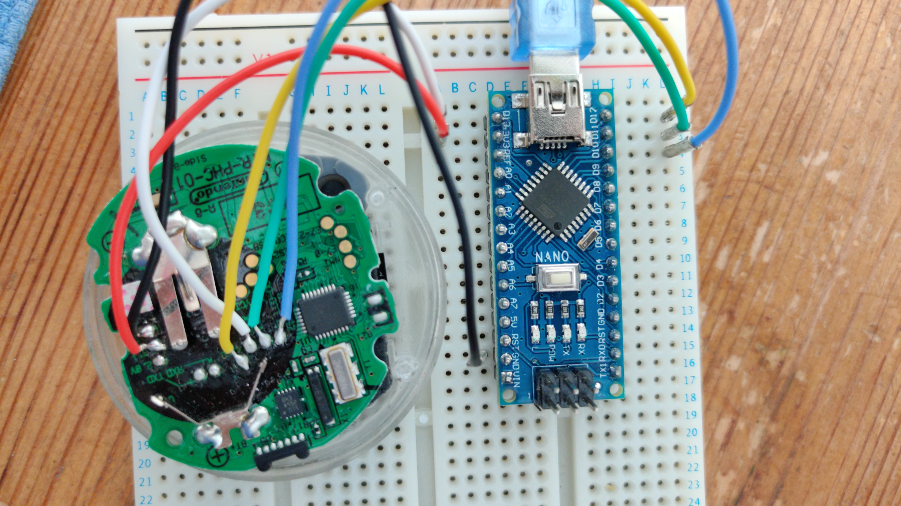

# Info on the ROM dump

## Dumping
Dumped with an arduino nano to the serial monitor in the arduino editor, then copy-pasted from there to a text file `furret-main-screen-*.txt`.
Done twice and compared to see if it was read properly.

Code has been modified from the arduino sketch at [andre-richter/arduino-spi-dump-eeprom](https://github.com/andre-richter/arduino-spi-dump-eeprom).

I initially had trouble with getting data, but with the right delay in the read code, it somehow worked.
There is definitely bad soldering to do with this as well.

For wiring to the pokewalker board:


For breakout on the arduino:


ROM is 48K and is addressable from `0x0050` to `0xbfff` as per the [manual](../README.md#Renesas_Documentation).
This is the maximum capacity of the ROM as per the datasheet.


## Info on the ROM
I have no idea what's going on with the ROM to be honest.
I have never done any kind of diassembling for unknown architectures before or extracting ROMs from MCUs.

What got me excited about this was that the string `nintendo` came up as the first few bytes of the ROM.
There are no other readable strings in the binary.

This makes me think that all the writing on the pokewalker is as pictures or a custom encoding (ie not ascii-8bit).
There are also sections of the ROM that contain a few (\~50) bytes of data then are separated by zeroes and seem to be aligned to some offset.
I will have to look more at this and see what these are.
My suspicion is that they are images used by the pokewalker in menus etc.


## Objdump tools
On ubuntu, the package I used to disassemble was `binutils-h8300-hms`.
Then to get the assembly, I used
```
h8300-hms-objdump -m h8300 -b binary -D $file_name.bin > $file_name.S
```

For converting between I used 
```
xxd -r -p $file_name.txt $file_name.bin
```
to turn the hex ascii file into a raw binary file.
